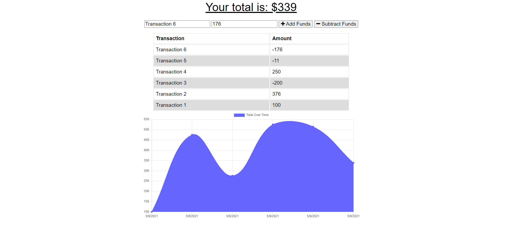

# Offline Budget Tracker 

# Description

This application gives a user the opportunity to track their budget offline while traveling. It will save all user inputs whether it has an internet connection or not and then update the user budget any time there is an internet connection.

## Table of Contents
 * [User Story](#User-Story)
 * [Building Tools](#Building-Tools)
 * [References](#References)

## Deployed Page
 * https://github.com/paxton44/Budget-Track

## User Story
<pre><code>As a User that is practicing social distancing, but still wants to have fun while staying safely at home 
I WANT an app that gives me a cocktail recipe when selected and also provides me with a playlist to go with it 
SO THAT I can still have fun while being responsible, and I can share with my friends remotely</code></pre>

## Building Tools 
 * CSS
 * Express
 * Heroku
 * HTML
 * Javascript
 * Node.js
 * Mongodb
 * Mongoose.js
 * Robo 3T

## References
1. https://robomongo.com
2. https://www.w3schools.com
3. https://youtube.com
4. https://developer.mozilla.org/en-US/docs/Web/Progressive_web_apps
5. https://www.heroku.com/

## Demo

